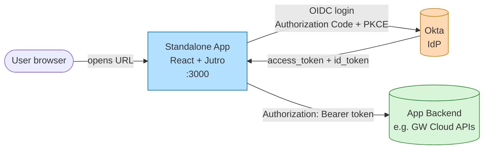
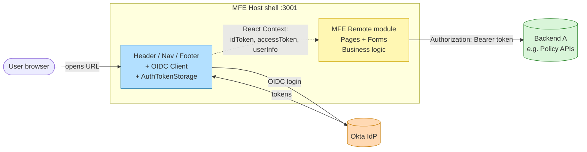
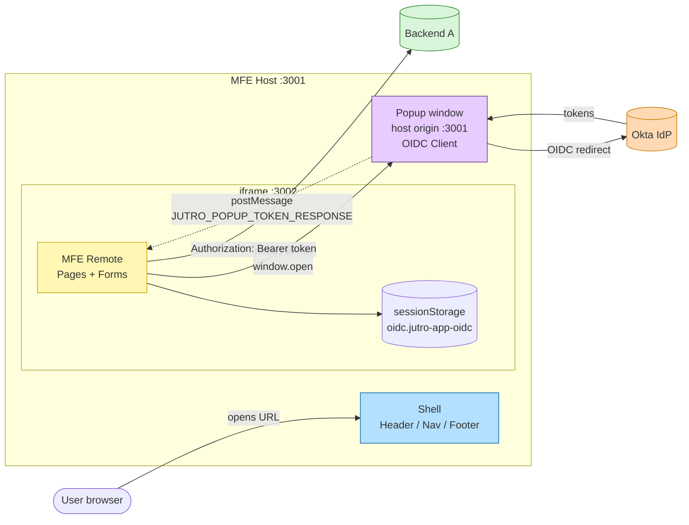
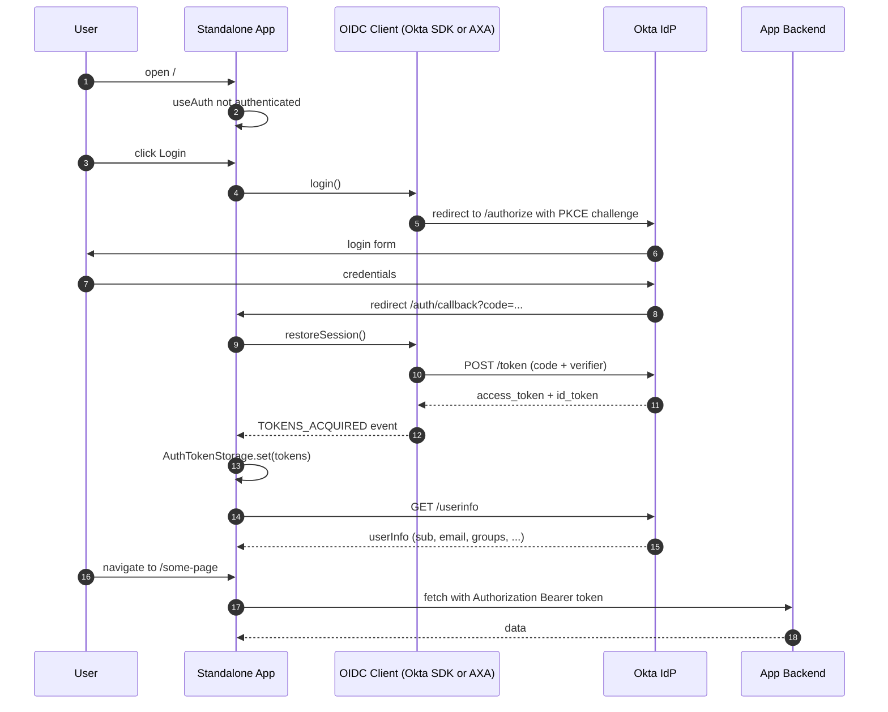
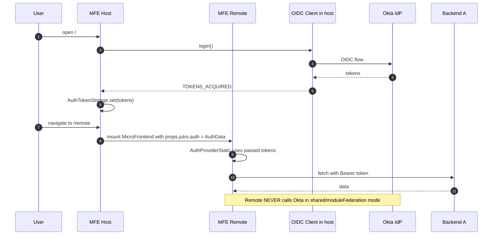
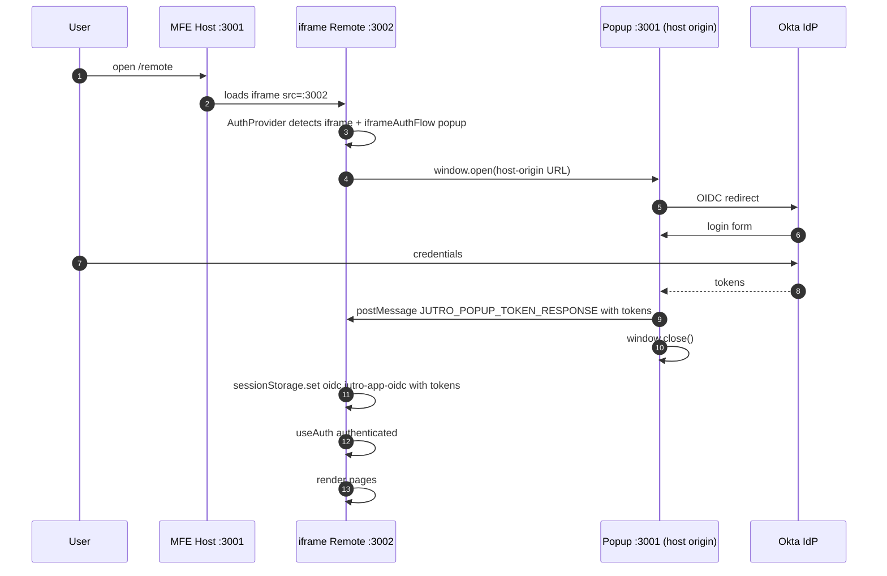
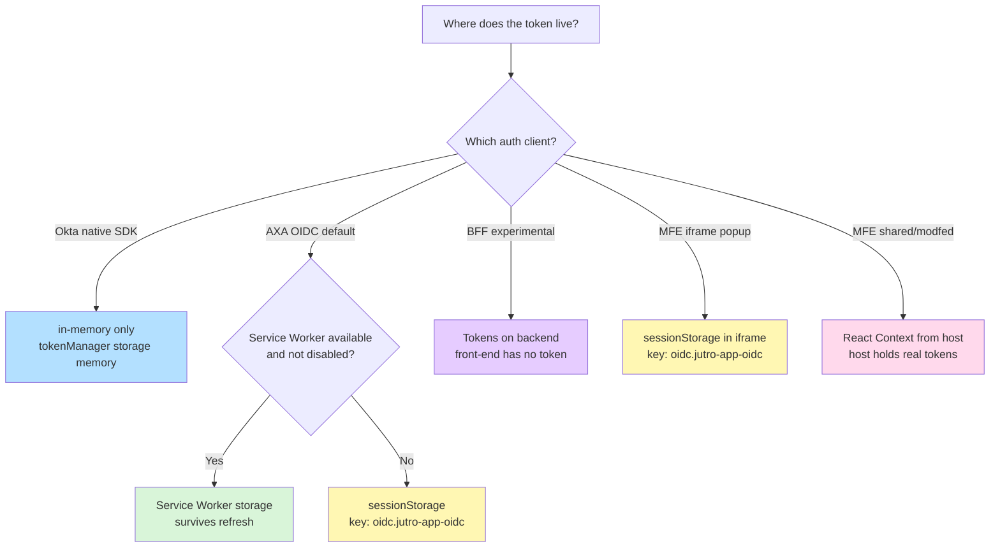
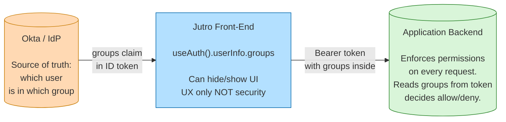
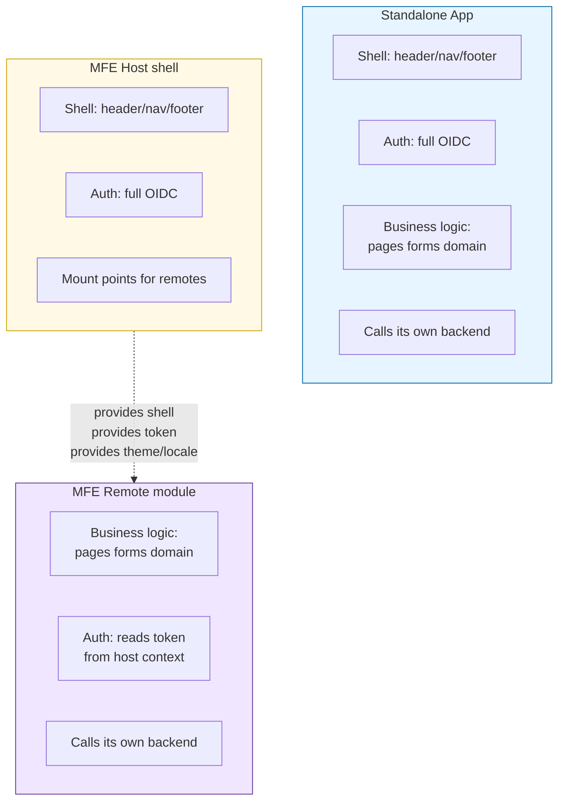

# Diagrams — Jutro Standalone vs MFE (auth flows + architecture)

Diagramy w formacie **Mermaid**. Renderują się natywnie w:
- GitHub (README, Issues, PR)
- VS Code (z podglądem Markdown)
- IntelliJ IDEA / WebStorm
- Notion, Obsidian, Confluence (z pluginem)
- **Lucid Chart** — Menu → Import → Mermaid → wklej kod
- draw.io / diagrams.net — Extras → Edit Diagram → paste Mermaid

> Mermaid diagrams. They render natively in GitHub / VS Code / Notion / Obsidian. To open in **Lucid Chart**: Menu → Import → Mermaid → paste the code block.

---

## 1. Standalone — architektura / architecture



**Insight:** brak pośrednika Jutro — aplikacja rozmawia z Oktą i backendem bezpośrednio.

---

## 2. MFE (shared / moduleFederation) — architektura / architecture



**Insight:** tylko host rozmawia z Oktą. Remote **nigdy** nie woła Okty bezpośrednio. Remote używa tokenu z contextu, wołając swój backend.

---

## 3. MFE (isolated / iframe popup) — architektura / architecture



**Insight:** iframe nie może wołać Okty (cross-origin). Popup na origin hosta robi OIDC i oddaje token przez `postMessage`. Token ląduje w `sessionStorage` wewnątrz iframe'a.

---

## 4. Standalone — login flow (sequence)



---

## 5. MFE (shared mode) — login flow (sequence)



---

## 6. MFE (iframe popup) — login flow (sequence)



---

## 7. Token / metadata storage (decision tree)



---

## 8. Persony / role — odpowiedzialności / responsibilities



**Krytyczne / Critical:** Jutro nie robi autoryzacji. Ukrywanie UI na bazie `groups` to wyłącznie UX. Real security = backend.

---

## 9. Standalone vs MFE Host vs MFE Remote — kto za co odpowiada



**Reguła kciuka / Rule of thumb:**
- **Standalone** = jeden produkt, wszystko w jednym
- **MFE Host** = rama dla wielu produktów, ale bez domain logic
- **MFE Remote** = domain logic, bez ramy

---

## Jak zaimportować do Lucid Chart / How to import to Lucid Chart

1. W Lucid → **File** → **Import Diagram** → wybierz **Mermaid**
2. Skopiuj dowolny blok ` ```mermaid ` z tego pliku (tylko zawartość, bez znaczników ` ``` `)
3. Wklej do okna importu → Lucid wyrenderuje i możesz edytować ręcznie

**Alternatywa dla innych narzędzi:**
- **draw.io / diagrams.net:** Extras → Edit Diagram → wklej Mermaid (od wersji 20.x)
- **GitHub:** wklej blok ` ```mermaid ` do README — renderuje się natywnie
- **Obsidian / Notion / Confluence:** natywne wsparcie Mermaid
